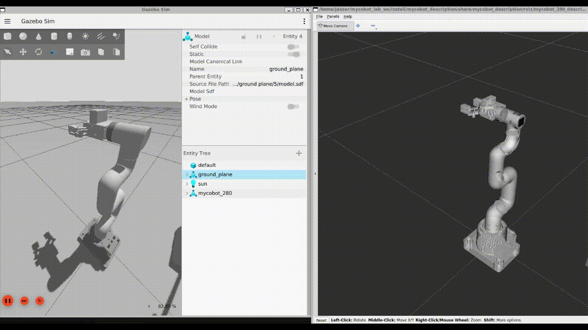

# mycobot_ros2_lab


Personal ROS 2 workspace for the myCobot robotic arm.
This project extends the [automaticaddison/mycobot_ros2](https://github.com/automaticaddison/mycobot_ros2) repository with custom scenarios and features.
At this stage, the focus is on **building the foundation**: model visualization, simulation, and basic control.

---

## 🚀 Current Features (Milestone 1)
- ✅ myCobot robotic arm URDF model created and visualized in **RViz2**
- ✅ myCobot spawned and simulated inside **Gazebo**
- ✅ Integration with **ros2_control** for sending commands to the arm

---

## 🛠️ Setup

### 1. Clone the repository
```bash
mkdir -p ~/mycobot_lab_ws/src
cd ~/mycobot_lab_ws/src
git clone https://github.com/Jasser000/mycobot_ros2_lab.git
cd ~/mycobot_lab_ws
```
### 2. Install dependencies
```bash
rosdep install --from-paths src --ignore-src -r -y
```
### 3. Build the workspace
```bash
colcon build
source install/setup.bash
```
## 📷 Preview
### 1.Visualize the URDF Model in RViz2
Launch the robot model using the urdf_tutorial display launch file:
```bash
ros2 launch urdf_tutorial display.launch.py \
  model:=/home/ubuntu/mycobot_lab_ws/src/mycobot_ros2_lab/mycobot_description/urdf/robots/mycobot_280.urdf.xacro
```
⚠️ **Note:** Replace `/home/ubuntu` with your own user’s absolute path to the workspace.


*Figure: myCobot robotic arm visualized in RViz2 with joints controlled via joint_state_publisher_gui.*

### 2. Simulate and Control myCobot in Gazebo
Run the bringup script to launch the Gazebo simulation (controllers are automatically started with `ros2_control`):

```bash
bash ~/mycobot_lab_ws/src/mycobot_ros2_lab/mycobot_bringup/scripts/mycobot_280_gazebo.sh
```

*Figure: myCobot spawned in Gazebo and controlled in real time using ros2_control.*

---

## 📌 Next Steps
- Add custom pick-and-place scenarios
- Extend perception modules for object detection
- Integrate MoveIt 2 with advanced planning demos

---

## 📖 Credits
Based on [automaticaddison/mycobot_ros2](https://github.com/automaticaddison/mycobot_ros2).

