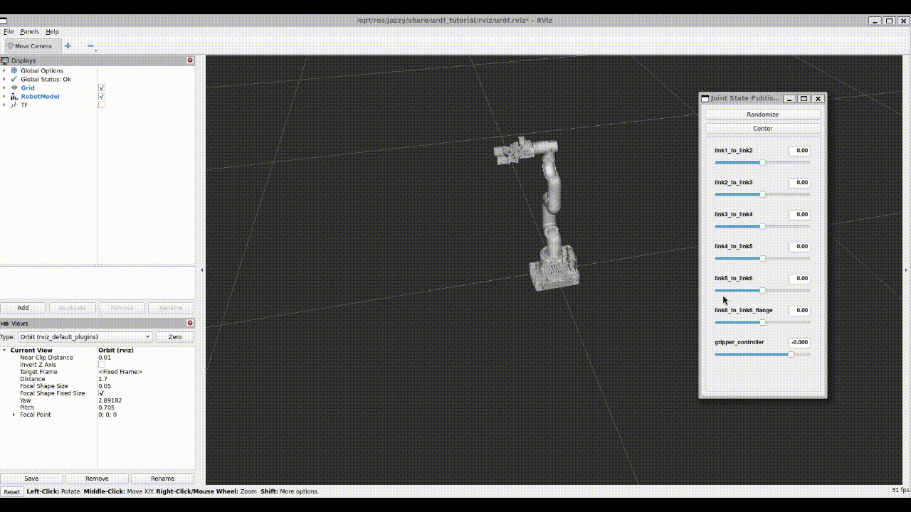

# mycobot_ros2_lab


Personal ROS 2 workspace for the **myCobot robotic arm**.
This project extends the [automaticaddison/mycobot_ros2](https://github.com/automaticaddison/mycobot_ros2) repository with **custom scenarios, simulation environments, and advanced motion planning**.

---

## 🚀 Current Capabilities (Milestone 3)

- ✅ **MoveIt 2** integration for motion planning and execution
- ✅ **Move Group** interface connected to simulated controllers
- ✅ **MoveIt Task Constructor (MTC)** demos with multiple strategies:
  - Alternative path costs *(default)*
  - Cartesian planning
  - Fallbacks
  - IK clearance costs
  - Modular planning
- ✅ Unified script to launch **Gazebo + MoveIt 2 + MTC demos** in one go

---

## 🛠️ Setup

### 1. Clone the repository
```bash
mkdir -p ~/mycobot_lab_ws/src
cd ~/mycobot_lab_ws/src
git clone https://github.com/Jasser000/mycobot_ros2_lab.git
cd ~/mycobot_lab_ws
```
### 2. Install dependencies
```bash
rosdep install --from-paths src --ignore-src -r -y
```
### 3. Build the workspace
```bash
colcon build
source install/setup.bash
```
## 📷 Preview
### 1.Visualize the URDF Model in RViz2
Launch the robot model using the urdf_tutorial display launch file:
```bash
ros2 launch urdf_tutorial display.launch.py \
  model:=/home/ubuntu/mycobot_lab_ws/src/mycobot_ros2_lab/mycobot_description/urdf/robots/mycobot_280.urdf.xacro
```
⚠️ **Note:** Replace `/home/ubuntu` with your own user’s absolute path to the workspace.


*Figure: myCobot robotic arm visualized in RViz2 with joints controlled via joint_state_publisher_gui.*

### 2. Simulate and Control myCobot in Gazebo
Run the bringup script to launch the Gazebo simulation (controllers are automatically started with `ros2_control`):

```bash
bash ~/mycobot_lab_ws/src/mycobot_ros2_lab/mycobot_bringup/scripts/mycobot_280_gazebo.sh
```

*Figure: myCobot spawned in Gazebo and controlled in real time using ros2_control.*

### 3. Task-Level Planning with MTC
Run the unified script to start Gazebo + MoveIt 2 + MTC demos:
```bash
bash ~/mycobot_lab_ws/src/mycobot_ros2_lab/mycobot_bringup/scripts/mycobot_280_mtc_demos.sh <exe_option>
```
Available `<exe_option>` values:
- `alternative_path_costs` (default)
- `cartesian`
- `fallbacks_move_to`
- `ik_clearance_cost`
- `modular`

Example:

```bash
bash ~/mycobot_lab_ws/src/mycobot_ros2_lab/mycobot_bringup/scripts/mycobot_280_mtc_demos.sh cartesian
```
This will:
- Launch **Gazebo** with *myCobot* and `ros2_control`
- Start **Move Group** with **RViz**
- Run the selected **MTC demo pipeline**


*Figure: myCobot executing a task-level motion pipeline with MoveIt Task Constructor.*


---

## 🗂️ Project Timeline

### Milestone 1 – Foundations
- URDF model visualized in **RViz2**
- myCobot spawned and simulated inside **Gazebo**
- Integration with **ros2_control** for basic control

### Milestone 2 – Motion Planning
- Integration with **MoveIt 2**
- Configured planning pipelines (**OMPL**, **Pilz Cartesian**, **STOMP**)
- Motion planning and execution in simulation

### Milestone 3 – Task-Level Planning *(current)*
- Added **MoveIt Task Constructor (MTC)** demos
- Automated bringup script for **Gazebo + MoveIt 2 + MTC**
- Multiple planning strategies supported

---
## 📌 Next Steps
- Add custom pick-and-place scenarios
- Extend perception modules for object detection
- Integrate MoveIt 2 with advanced planning demos

---

## 📖 Credits
Based on [automaticaddison/mycobot_ros2](https://github.com/automaticaddison/mycobot_ros2).

